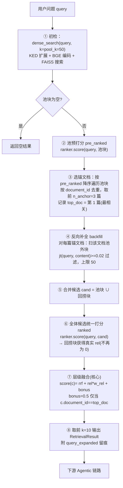

# V4（run2 两步式层级检索）论文素材

> 本文档为论文写作准备的**三件套**：
> **① V4 流程图 & 框架图**（高水平论文级，含 Mermaid / 结构描述，可直接转绘矢量图）；
> **② V4 伪代码**（与生产实现 `retriever.py::two_stage_retrieve_v4` 一一对应）；
> **③ V4 实现方式 / 动机 / 逐层递进叙述**（用通用流畅的论文语体，讲清"为什么提 V4、V4 怎么做、如何一步步迭代上来"）。
>
> 代码依据：`LINS-Industrial/retrieval/retriever.py`（`two_stage_retrieve/_v2/_v3/_v4`）、
> `LINS-Industrial/_diag_recall_run2.py`（`LLMRelevanceRanker`）、
> `docs/agentic_system_whitepaper.md`（演进结论与 7 路对比数据）。

---

## 0. 术语表（论文口径统一）

| 术语 | 含义 |
|---|---|
| **KED** | Keyword Extraction & Decomposition，查询词法扩展，用于第一步初检提升召回 |
| **dense_search / 初检池(pool)** | 用 embedding（BGE-small-zh）在 FAISS 向量库取宽候选池 `pool_k` 个块 |
| **二阶段相关性评估器（ranker）** | 用真实 LLM（DeepSeek）**仅凭【问题+候选块】** 输出每块 0~1 适配分；**绝不注入标注答案/GT** |
| **锚文档（anchor document）** | 初检池中按 LLM 预打分的 relevant top 文档（按 `document_id` 去重取前 `n_anchor=3` 篇） |
| **反向补全（backfill / 回捞）** | 对每个锚文档，把该文档在初检池**之外**的其余块拉回候选集，补全"同源文档被初检截断漏掉"的块 |
| **top_doc** | 锚文档中相关性最高的第 1 篇，**唯一**享受 anchor_bonus 加权的文档 |
| **anchor_bonus（w_anchor）** | 融合阶段给 top_doc 下所有候选块加的排序加权（默认 0.5） |
| **jt（chinese_jt）** | 中文 bigram Jaccard(Tanimoto) 词法重合度，作为回捞块的"防噪声"过滤阈值 |

---

# 任务一：V4 的流程图 & 框架图

## 1.1 框架图（Framework Overview：V4 在全局架构中的位置）

```mermaid
flowchart TB
    subgraph K["知识层 (Knowledge Layer)"]
        KS["异构知识源<br/>IndustryBench / 技术手册 / PDF / 工程标准"]
        UD["UnifiedDocument 统一文档"]
        CB["Corpus Builder<br/>去重·切块·统计"]
        IDX["FAISS 索引<br/>BGE-small-zh embedding<br/>~55k chunks"]
    end

    subgraph R["检索层 (Retrieval Layer) —— V4（本文核心）"]
        KED["KED 词法扩展"]
        P1["① 初检（recall）<br/>dense 宽候选池 pool=50"]
        RANK["② LLM 相关性评估<br/>DeepSeek 打分 0~1 绝不碰 GT"]
        ANCHOR["③ 锚文档定位<br/>document_id 去重取 top 3 篇"]
        BACK["④ 文档级反向补全<br/>同源块回捞 + jt 过滤"]
        FUSE["⑤ 层级融合<br/>bonus 仅给 top_doc"]
        OUT["RetrievedChunk top-k=10<br/>带 *run2 引用"]
    end

    subgraph A["Agentic 推理层 (Reasoning Layer)"]
        TA["TaskAnalyzer<br/>任务/题型判定"]
        SP["StrategyPlanner<br/>执行图规划"]
        EX["GraphExecutor<br/>organize→reason→verify"]
        GEN["带 [n] 引用答案"]
    end

    subgraph E["评估层 (Evaluation Layer)"]
        SC["0–3 分评分 + SV 安全"]
        LC["引用 Pre./Rec./F1"]
        RE["Recall@k / MRR / NDCG"]
    end

    KS --> UD --> CB --> IDX --> P1
    KED --> P1
    P1 --> RANK --> ANCHOR --> BACK --> FUSE --> OUT
    OUT --> TA --> SP --> EX --> GEN
    GEN --> SC & LC
    RE -.评估检索层.<- P1
```

**图注（Caption）**：V4 位于"外部检索层"，是一种**两阶段层级检索（two-stage hierarchical retrieval）**：
第一阶段（recall）用一个宽候选池粗召回；第二阶段用一个独立的 LLM 相关性评估器对候选池重排、
并把"相关性最高的少数锚文档"的池外同源块反向补全，最终以"回捞范围宽、加权只给最相关文档"的
层级融合输出 top-k，供 Agentic 推理层组织证据并生成带引用答案。

## 1.2 流程图（V4 内部 Algorithm Flow——逐节点）



## 1.3 V4 融合打分公式（图/文可再引用）

对候选块 `c`（池块或回捞块），融合分数为：

```
score(c) = w_dense / (60 + rank_c)        —— RRF 项；回捞块 rank 取常量档(60+pool_k)
         + rel(c) × w_rel                 —— 二阶段 LLM 相关性分(归一化 0~1)
         + w_anchor                        —— 0.5，仅当 c.document_id == top_doc；否则 0
```

默认参数：`pool_k=50, n_anchor=3, backfill_th=0.02, backfill_max=50,
w_dense=w_rel=1.0, w_anchor=0.5, k=10`。

---

# 任务二：V4 的伪代码

```text
算法：V4（two-stage Hierarchical Retrieval, run2 v4）
输入：query（问题）、ranker（LLM 相关性评估器）、
      k=10（输出条数）、pool_k=50（初检池宽）、n_anchor=3（锚文档篇数）、
      backfill_th=0.02、backfill_max=50、w_dense=w_rel=1.0、w_anchor=0.5
输出：RetrievalResult { chunks=top-k 个 RetrievedChunk(带融合分) }

———————————————— 第一阶段：宽池初检（recall） ————————————————
pool  ← dense_search(query, k=pool_k, use_ked=True)     # KED 扩展 + BGE + FAISS
pool_chunks ← pool.chunks
if pool_chunks 为空:
    return pool                                          # 无料可检，直接返回

———————————————— 第二阶段.A：锚文档定位（选最相关少数文档）———————
pre_ranked ← ranker.score(query, pool_chunks)           # 仅凭【问题+池块】打分
           # 失败则退化为初检序；随后归一化到 0~1
by_rel ← 按 pre_ranked 降序对 pool_chunks 排序

ordered_docs ← []; seen ← {}
for c in by_rel:                                        # 按 document_id 去重
    if c.document_id 非空 且 c.document_id ∉ seen:
        seen ←+ c.document_id
        ordered_docs ←+ c.document_id
    if |ordered_docs| ≥ n_anchor:  break                 # 只追溯前 n_anchor 篇
anchor_doc_ids ← set(ordered_docs)
top_doc ← ordered_docs[0]                               # 最相关文档(= rel 最高那篇)

———————————————— 第二阶段.B：文档级反向补全（扩召回） ————————————
backfilled ← ∅
for doc ∈ anchor_doc_ids:                               # 对每篇锚文档
    for (cid, chunk_data) in chunks:                     # 扫描全部语料块
        if chunk_data.document_id ≠ doc:  continue       # 仅同源文档
        if cid ∈ pool_ids:  continue                     # 跳过已在池内的
        if backfill_th>0 且 chinese_jt(query, content) < backfill_th:
            continue                                      # 词法太弱 → 丢弃防噪
        backfilled ←+ cid
        if |backfilled| ≥ backfill_max:  break

———————————————— 第二阶段.C：合并候选并统一打分 ——————————————————
cand ← pool_chunks ∪ {backfilled 转 RetrievedChunk}
ranked ← ranker.score(query, cand)                       # 回捞块获得真实 rel
ranked ← 归一化(ranked, 0~1)

———————————————— 第二阶段.D：层级融合（V4 核心差异） ————————————
for c ∈ cand:
    is_backfill ← (c.chunk_id ∈ backfilled)
    rrf ← w_dense/(60+pool_k) if is_backfill else w_dense/(60+c.rank)
    rel ← ranked[c.chunk_id] * w_rel
    bonus ← w_anchor if (top_doc 非空 且 c.document_id == top_doc) else 0.0
    score[c.chunk_id] ← rrf + rel + bonus                # ← 只给 top_doc 加权

order ← 按 score 降序取前 k
merged ← RetrievalResult()
for (cid, sc) ∈ order:
    c ← obj[cid]; c.score ← sc; c.rank ← i+1
    merged.chunks ←+ c
merged.query_expanded ← "run2v4(pool=..,anchor_docs=..,top_doc_only_bonus=1,backfill=..,bf_in_topk=..)"
return merged
```

---

# 任务三：V4 的实现方式、动机，与逐层递进

## 3.1 为什么提出 V4（研究动机）

工业知识问答（IndustryBench：10 行业 × 7 能力 × 3 难度）中，检索质量是端到端答案分数的
**主要上界**（分阶段 S4 诊断判定，Hit@1 0.5→目标 0.7）。现有单步检索（base/hybrid）只做
"一次召回 + 排序"：它的问题在于，一个**相关文档**的所有块是**切块后平铺**在向量库里的；
当只有部分块与问句在向量空间上足够近、被初检 top-k 命中时，**同一文档里其余"同源互补"的块
会因为排名太靠后而被整体截断**——这些块往往正是装配标准号、工艺参数、补充细节等完整答案所需的
部分证据。也就是说，单步检索存在系统性的**召回不完整（partial-document coverage）**：证据捞到了
"一半"，另一半因为同源被挤到 top-k 之外而丢失。

于是引入了 **run2 两步式检索（two-stage retrieval）** 的总体思想：
> 第一步先放宽召回（wide pool）粗筛，第二步用一个**独立的二阶段 LLM 相关性评估器**，
> 仅凭【问题 + 候选块】对候选重排，并沿"高相关锚文档"做**文档级反向补全（document-level
> backward completion）**，把被初检截断的同源块拉回候选集，再融合排序输出。

关键设计约束：二阶段评估器**只把问题与候选块喂给 LLM**，**绝不注入标注答案 / GT / knowledge_text**，
从而在"补全召回"的同时避免"直接读答案"的嫌疑，保证检索评估的可信度。

**提出 V4 的直接动机**：初版两步式（v1→v3）各有一个"机制缺陷或负优化"被逐步暴露——v1 回捞块
相关性分恒为 0 进不了 top-k；v2 修好打分但对召回无增益；v3 试图扩大回捞范围却因"给 3 篇文档
全加权"稀释相关块而**负优化**。V4 正是在 v3 教训上把"回捞范围"与"排序加权"**解耦**，同时保住
v3 广撒网的回捞广度、又纠正其对 top-k 的稀释，最终成为唯一在召回与排序上都实质正增益的变体。

## 3.2 V4 是怎么实现的（方法描述）

V4 = `two_stage_retrieve_v4`，是一条**两阶段、四小步**的层级检索管线，把"召回（recall）"与
"精排（precision）"分离开：

**(1) 宽池初检（recall）。** 对问题先做 KED 词法扩展，再经 BGE 编码在 FAISS 上取 **宽候选池**
（`pool_k=50` 个块）。这一步的标准是"广"，宁可多召回也不漏：

**(2) 锚文档定位（选点）。** 用一个 LLM 相关性评估器只对**池内块**打分（`pre_ranked`），
按相关性降序扫描块，并按 `document_id` 去重，取出相关性最高的 **前 3 篇不同文档**作为
"锚文档"，其中相关性最高的第 1 篇记为 **`top_doc`**。这一步选出了"最可能承载正确答案的少数文档"。

**(3) 文档级反向补全（扩召回）。** 对每篇锚文档，在**整个语料**里找回该文档的、**不在初检池内**的
其余同源块，并用**中文 bigram Jaccard（jt）≥ 0.02** 过滤掉与问题词法无交集的块（防噪声灌入）、
以 `backfill_max=50` 限量。这一步把"单步检索截断造成缺档"的互补证据重新捞回来。

**(4) 层级融合（精排，V4 核心差异）。** 将池块与回捞块合并为候选集，**统一**交给 LLM 评估器重新打分
（使回捞块获得真实的 rel 分数）；再按融合公式排序取 top-k：

```
score(c) = rrf(c) + rel(c) × w_rel + bonus(c)
```

其中 **bonus（anchor_bonus，0.5）只授给 `top_doc` 这一篇文档的块**；第 2、3 篇锚文档的块
一律不以加权硬挤，**只凭真实 rel 分与池块公平竞争**。

**这一"范围宽、权重严"的非对称设计**，正是 V4 的名字含义（V4 = 把回捞广度与排序严谨度解耦
后的层级检索）。它使 V4 在召回端（广撒 3 篇补全）和精排端（只保最相关文档不被稀释）同时受益。

## 3.3 如何逐层递进实现（v1 → v4 的迭代史，每条都对应一个已验证的教训）

| 版本 | 机制与改动 | 暴露的问题 / 结论 |
|---|---|---|
| **base** | `retrieve`, 纯 top10 dense。 | 对照基线；暴露"同源块被截断"的召回不完整问题（补全机会丢失）。 |
| **v1** | 首次两步式：捞宽池 → LLM 只给池块打分 → 取 top-`n_anchor` 块作锚 → 回捞同源块 → 融合。 | **机制缺陷验证**：回捞块只被 `pool` 打分、`ranked` 里恒缺（rel=0），集合论上必然进不了 top-k（5 题实证 100% 落榜）。回捞"机制"被证实，但补全失效。 |
| **v2** | 调整执行顺序：先回捞，再把【池块+回捞块】合并为候选集，**统一打分**，使回捞块带上真实 rel 参与竞争。 | **打分覆盖缺陷修复**；回捞块 rel 全覆盖且非零（0.35~0.92）。但 recall 指标与 v1 几乎持平——机制正确了，召回无实质增益。附带发现真实 LLM 打分需放大 `max_tokens`。 |
| **v3** | "选锚"改为按 document_id 去重取 `n_anchor=3` 篇文档扩大回捞范围；融合时**3 篇文档全体块**都吃 anchor_bonus。 | **负优化**：低相关文档靠 bonus 硬挤 top10、稀释真正相关块；21 题 cov −1.8pp / good% −4.8pp。"扩大回捞广度"方向正确但"给 3 篇都加权"被证伪。 |
| **v4** | 保持 v3 的"按文档去重取 3 篇回捞"广度，但**anchor_bonus 只给第 1 篇（top_doc）**；其余只靠真实 rel 竞争。 | **唯一正增益变体**：把"回捞范围"与"排序加权"解耦（recall 阶段广、precision 阶段严）。21 题 cov +2.2pp、NDCG +2.6pp；50 样本真实验中 7 路方法全面第一。 |

**递进逻辑（一句话）**：v1 → v2 解决了"机制正确（回捞块能有分）"，v2 → v3 解决了"回捞范围
（能覆盖到 3 个不同源文档）"，v3 → v4 解决了"加权不当（把范围扩大引起的噪声重新压制、只信任最相关
文档）"——每一步都只改**一个**点、并用可量化指标验证"改好了没"，最终收敛到 V4。

## 3.4 V4 的实验结论（用数据支撑论文）

**7 路检索 recall 对比（50 样本 · 真实 DeepSeek LLM 二阶段评估）：**

| 方法 | cov@10 | good% | hit@1 | hit@3 | MRR | NDCG |
|---|---|---|---|---|---|---|
| single(base) | 36.2% | 32% | 52% | 62% | 58.1% | 57.7% |
| multi | 35.6% | 32% | 32% | 54% | 45.2% | 50.7% |
| hybrid | 38.2% | 34% | 52% | 64% | 58.9% | 57.9% |
| v1 | 45.5% | 42% | 54% | 68% | 61.3% | 61.4% |
| v2 | 45.2% | 44% | 54% | 68% | 61.2% | 61.2% |
| v3 | 42.8% | 44% | 56% | 68% | 62.5% | 60.4% |
| **v4** | **46.7%** | **48%** | **56%** | **72%** | **63.0%** | **65.7%** |

**读表结论（可直接写成论文段落）**：
1. **两步式整体碾压单步基线**——最弱的 v3(42.8%) 也高于 best baseline(single/hybrid ≈38%)，
   说明"LLM 重排 + 文档级回捞"是召回质量的真实来源（run2 vs base，v1 即起带来约 +7pp）。
2. **V4 是 7 路里唯一在 cov@10 / good% / hit@1 / MRR / NDCG 五项全面第一**，尤其 NDCG 65.7%
   遥遥领先，说明相关块不仅捞到、还排得更靠前更集中（排序质量最优）。
3. **V4 的分层增益**：安全合规（57%）、故障诊断（57%）、工程计算（28%）等能力上均为各方法最优，
   且在各能力无回退。

**端到端（生产 Agentic 链路）**：把 V4 接入 `AgenticRAGEngine`（analyzer→planner→organizer→reason→verify），
14 题安全回归 base 2.50 → run2(v4) **2.71（Δ=+0.21）**，涨3/跌0/持平11、零回退——检索层正增益被
安全兑现为作答得分。

**最终生产定案**：检索层默认 = **run2 两步式 v4**（`two_stage_retrieve_v4`；
`Run2AgenticRAGEngine version=v4`），并支持 `--version {v1,v4}` 一键回切基线以做消融。

## 3.5 可复现性（论文应提供的复现指引）

```bash
cd LINS-Industrial
# 检索层 7 路 recall（50 样本，真实 LLM，约 24min —— 建议后台跑）
python _ab_agentic_recall_7way.py --n_total 50 --sim     # Sim 冒烟（快）
python _ab_agentic_recall_7way.py --n_total 50 --llm     # 真实 DeepSeek
# 端到端 A/B（base vs run2-v4）
python _e2e_agentic_run2.py --per_cap 2 --pool 50 --seed 7 --version v4
```
实现源码：`retrieval/retriever.py::two_stage_retrieve[_v2,_v3,_v4]`；
LLM 二阶段评估器：`_diag_recall_run2.py::LLMRelevanceRanker`；
数据存档：`results/agentic_recall_7way/*.md/.json`、`results/run2_v1v2/*`。
