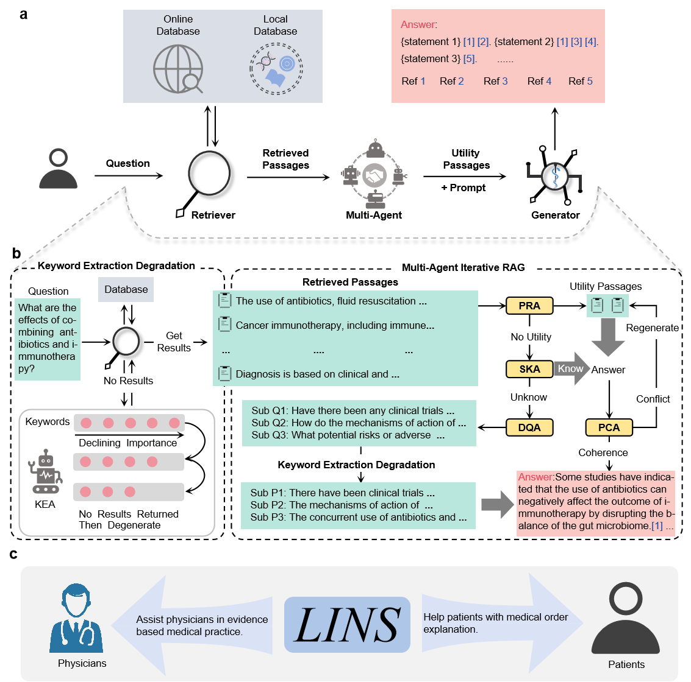

# 🏥 LINS: 多智能体检索增强框架 — 面向 DeepSeek / 其他 LLM 的中文适配版

> **基于原版 LINS (Multi-Agent Retrieval-Augmented Framework for Medical Responses) 的 DeepSeek 适配分支**

<div align="justify">
本项目基于 <a href="https://github.com/WangSheng21s/LINS">LINS 原版框架</a>，深度适配了 <b>DeepSeek API</b>（deepseek-chat），同时保持对 GPT / Gemini / Qwen / Llama 等 LLM 的完整兼容。LINS 是一种无需额外训练或微调的通用医学检索增强生成（RAG）框架，适用于任何医学垂直领域。

框架内置了创新的 <b>MAIRAG</b>（多智能体迭代检索增强生成）和 <b>KED</b>（关键词提取退化）算法，能够生成高质量的基于引用的生成文本（CBGT），并提供了 <b>Link-Eval</b> 自动化评估系统。
</div>

<br>



---

## ✨ 主要特性

| 特性 | 说明 |
|------|------|
| 🔌 **多模型支持** | DeepSeek / GPT-4o / Gemini / Qwen / Llama，一键切换 |
| 🤖 **多智能体 MAIRAG** | 多智能体迭代检索增强生成，提升回答质量 |
| 🔑 **KED 检索算法** | 关键词提取退化，确保检索稳定性和覆盖率 |
| 📚 **多源检索** | PubMed 在线检索 + Bing 搜索 + 本地知识库 |
| 📊 **Link-Eval 评估** | 基于引用的自动评估系统（精准率、召回率、F1 等） |
| 🔒 **隐私保护** | 支持全本地化部署（Ollama + BGE），数据不外传 |

---

## 🚀 快速开始

### 环境配置

```bash
# 1. 克隆仓库
git clone https://github.com/zx12671/research_agent.git
cd research_agent

# 2. 创建 conda 环境
conda create --name LINS python=3.11.6 -c conda-forge
conda activate LINS

# 3. 安装依赖
pip install -r ./LINS-main/requirements.txt

# 4. 安装 PyTorch（以 CUDA 11.8 为例）
pip install torch==2.1.0+cu118 torchvision torchaudio -f https://download.pytorch.org/whl/cu118/torch_stable.html
```

### 设置 API Key

```python
import os
os.environ['DEEPSEEK_API_KEY'] = 'sk-your-deepseek-api-key'   # DeepSeek
os.environ['OPEN_API_KEY'] = 'sk-your-openai-api-key'          # OpenAI（可选）
os.environ['GEMINI_KEY'] = 'your-gemini-key'                   # Gemini（可选）
```

---

## 🧪 测试脚本使用示例

### 1️⃣ 快速验证：`test_deepseek.py`

快速验证 DeepSeek API 是否正常工作，包含：
- ✅ 基础对话测试（无需检索器）
- ✅ Database 配置测试（PubMed / Bing / HERD）
- ✅ KED 检索算法测试
- ✅ LinkEval 评估测试

**运行命令：**

```bash
# 从 LINS-main 目录运行
cd LINS-main
python test_deepseek.py
```

**预期输出示例（基础对话）：**

```
============================================================
测试 1：基础对话（仅 DeepSeek，无需检索器）
============================================================
问：在临床上，对于帕金森病患者，使用 MAO-B 抑制剂（如司来吉兰、雷沙吉兰）作为早期单药治疗的利弊是什么？
答：MAO-B 抑制剂（如司来吉兰、雷沙吉兰）作为帕金森病早期单药治疗的利弊分析如下：
【优点】
1. 症状改善：...
2. 神经保护潜力：...
【缺点】...
============================================================
```

### 2️⃣ 完整评估：`test_deepseek_lins_full.py`

在三个医学基准数据集上运行完整的 LINS 框架评测，包括 MAIRAG 生成、后处理规则、LinkEval 评估：
- 📗 **PubmedQA** — 20 个样本
- 📘 **MedQA-US**（美国执业医师考试）— 15 个样本
- 📕 **MedQA-Mainland**（中国大陆执业医师考试）— 15 个样本

**运行命令：**

```bash
# 注意：这个脚本在上级目录运行，它会导入 LINS-main 作为模块
cd ..
# 当前应在 project_root/ 下
python test_deepseek_lins_full.py
```

**运行结果示例：**

```
============================================================
【方案二】PubmedQA 评测 (20 个样本)
============================================================
已加载 20 条 PubmedQA 测试样本:
  [12345] For patients with ... → answer: yes
  [12346] Is ... effective for ... → answer: no
  ...

---------- Progress ----------
样本 1/20 | PMID: 12345 | answer: yes
  >> MAIRAG 回答生成完成...
  >> 后处理判断: 不需要强制改为 maybe
  >> LinkEval 评估完成
  >> Overall Score: 0.85

✅ 评估完成！结果保存至:
  - ./eval_results_lins_full/pubmedqa_details.jsonl
  - ./eval_results_lins_full/pubmedqa_results.json
```

### 3️⃣ 测试结果格式

评估结束后，结果保存在 `./eval_results_lins_full/` 目录：

```jsonc
// pubmedqa_results.json（示例）
{
  "accuracy": 0.85,
  "total_samples": 20,
  "correct_count": 17,
  "summary": {
    "avg_overall_score": 0.82,
    "avg_citation_set_precision": 0.72,
    // ...
  }
}
```

---

## 🔧 LINS 核心用法

### 初始化 LINS

```python
from model.model_LINS import LINS

# DeepSeek + PubMed
lins = LINS(
    LLM_name='deepseek-chat',                    # 主 LLM
    assistant_LLM_name='deepseek-chat',           # 辅助 LLM（多智能体）
    retriever_name='none',                        # 检索器（'none'=仅 DeepSeek 对话）
    DeepSeek_keys='sk-your-key',
    database_name='pubmed'                        # 数据库
)

# 或使用 GPT-4o + text-embedding-3-large
lins = LINS(
    LLM_name='gpt-4o',
    retriever_name='text-embedding-3-large',
    database_name='pubmed'
)
```

### MAIRAG：多智能体检索增强生成

```python
response, urls, retrieved_passages, history, sub_questions = lins.MAIRAG(
    question="For Parkinson's disease, whether prasinezumab showed greater benefits "
             "on motor signs progression in prespecified subgroups with faster motor progression?"
)
```

### KED：关键词提取退化检索

```python
# 关键词提取
keywords = lins.keyword_extraction(
    question="What is the molecular mechanism of alpha-synuclein aggregation?",
    max_num_keywords=5
)

# KED 完整搜索
ked_results = lins.KED_search(
    question="What is the molecular mechanism of alpha-synuclein aggregation?",
    topk=10
)
```

### 快速对话

```python
response, history = lins.chat(question="hello", history=None)
```

### 循证医学实践（AEBMP）

```python
response, urls, retrieved_passages, history, PICO_question = lins.AEBMP(
    PICO_question="For Parkinson's disease, whether prasinezumab showed greater benefits...",
    if_guidelines=False,
    patient_information="A 76-year-old female patient..."
)
```

### 医嘱解释（MOEQA）

```python
medical_term_explanations, clinical_answer = lins.MOEQA(
    if_QA=True,
    if_explanation=True,
    question="What causes ischemic bowel disease?",
    explain_text="Preliminary Diagnosis: Ischemic Bowel Disease...",
    patient_information="Gender: Female, Age: 53 years..."
)
```

---

## 📊 评估指标说明

LINS 的 Link-Eval 自动化评估系统从以下维度评估回答质量：

| 指标 | 简称 | 说明 |
|------|------|------|
| 引用集精准率 | CSP | 引用的证据集合是否准确 |
| 引用精准率 | CP | 单条引用的准确性 |
| 引用召回率 | CR | 应引用的证据是否完整覆盖 |
| F1 分数 | F1 | CSP 与 CR 的调和平均 |
| 陈述正确性 | SC | LLM 生成陈述的医学正确性 |
| 陈述流畅度 | SF | 语言表达的自然流畅程度 |
| 总体评分 | OS | 综合评分（加权平均） |

---

## 📁 项目结构

```
.
├── README.md                    # 本文件
├── test_deepseek_lins_full.py   # DeepSeek 完整评测脚本
├── LINS-main/
│   ├── test_deepseek.py         # DeepSeek 快速验证脚本
│   ├── lins_test_common.py      # 公共测试工具模块
│   ├── model/
│   │   ├── model_LINS.py        # 核心 LINS 模型
│   │   ├── database.py          # 数据库接口
│   │   ├── retriever_model.py   # 检索器
│   │   └── chat_llms.py         # LLM 调用封装
│   ├── evaluate/                # 评估脚本
│   ├── metric/                  # 评估指标
│   ├── add_dataset/             # 自定义数据集添加
│   └── assets/                  # 资源文件
├── eval_results_lins_full/      # 评估结果输出目录
│   ├── pubmedqa_results.json
│   ├── medqa_us_results.json
│   └── medqa_mainland_results.json
```

---

## 📚 扩展阅读

- 原版 README（英文）：[README.md](./LINS-main/README.md)
- 详细配置文档：[README_details.md](./LINS-main/README_details.md)

---

## 📄 许可

本项目基于 [Apache-2.0 License](./LINS-main/LICENSE)。

> 原版 LINS 论文：*LINS: A Multi-Agent Retrieval-Augmented Framework for Enhancing the Quality and Credibility of LLMs' Medical Responses*
